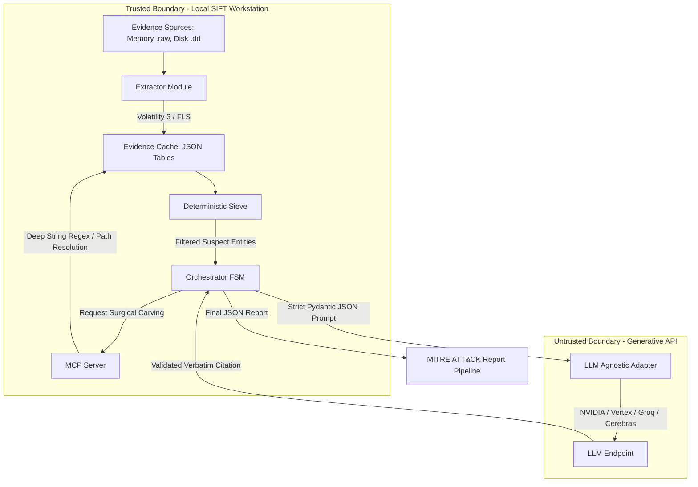

# Project Mantis: Autonomous DFIR Agent

Welcome to the Project Mantis repository! This project is an autonomous Digital Forensics and Incident Response (DFIR) framework designed to ingest raw memory and disk images, extract artifacts using SIFT Workstation tools, and perform deterministic, hallucination-free triage using an LLM Agnostic Provider architecture.

**The final, stable hackathon build is located in [`agent_v0.5.2_stable-hackathon`](./agent_v0.5.2_stable-hackathon/).** All other directories represent the iterative architectural evolution of the agent.

---

## Setup & Installation Instructions

To run the agent locally, please navigate to the stable build directory and follow the complete, step-by-step installation instructions provided there:
👉 **[View Full Setup Instructions Here](./agent_v0.5.2_stable-hackathon/README.md#0-installation)**

**Try-It-Out Access:** 
To test the agent, you will need a memory/disk image. Project Mantis was designed to operate entirely locally on the SIFT Workstation to maintain chain-of-custody privacy. You can test it against the public CFReDS or ROCBA datasets (see "Evidence Dataset Documentation" below for download links) by pointing your `PM_EVIDENCE_DIR` environment variable to the downloaded images.

---

## Architecture Diagram

The following Mermaid diagram illustrates how the components of Mantis interact, including the trust boundaries between deterministic extraction and the Generative AI orchestration.

---

## Core Architectural Innovations (For Evaluators)

To address the challenges of autonomous incident response, Mantis implements several rigorous structural designs:

1. **Architectural Guardrails:** Rather than just telling an LLM to "be careful" via system prompts, Mantis physically restricts the agent. The `mcp_server.py` exposes only strict, read-only typed functions (no write access). Furthermore, the `sieve.py` acts as a deterministic, math-based heuristic filter that forces the LLM to evaluate actual suspect entities, preventing it from wandering.
2. **Autonomous Self-Correction Loop:** Mantis employs an adversarial multi-agent debate FSM. If the primary "Prosecutor" agent claims an artifact is malicious, a separate "Defense Attorney" agent aggressively attempts to overrule it by cross-referencing benign administrative logic and baseline IT tags. Finally, a deterministic "Verifier" audits the debate. This forces organic self-correction without human intervention.
3. **100% Audit Trail Traceability:** To prevent the "confident presentation of hallucinated findings," Mantis implements a **Hard Grounding Layer**. The LLM is structurally forced via strict Pydantic schemas to output an `exact_telemetry_quote` for every claim. If the substring does not literally exist in the evidence tool output, the run is rejected. This allows evaluators to trace every single claim in the final synthesis directly back to a specific tool execution log.

---

## Evidence Dataset Documentation

During development and final validation, Project Mantis was aggressively tested against two prominent, publicly available DFIR challenge datasets:
1. **CFReDS Data Leakage Case:** A complex insider threat scenario involving exfiltration.
2. **ROCBA (Ransomware):** A destructive malware dataset requiring deep process hollowing and registry persistence tracking.

Judges can download these datasets directly here: 

CFReDs Data Leakage Case: https://cfreds.nist.gov/all/NIST/DataLeakageCase

Rocba Case: https://sansorg.egnyte.com/fl/HhH7crTYT4JK#folder-link/HACKATHON-2026/Standard%20Forensic%20Case

---

## Accuracy Report & Self-Assessment 

Below is my self-assessment regarding the agent's accuracy across testing:

- **False Positives:** The deterministic Sieve initially threw a high rate of false positives on native Windows binaries (like `svchost.exe`) because of matching LOTL (Living off the Land) heuristics. To counter this, I introduced the `BaselineEngine` and the "Presumption of Benignity" rule, which successfully dropped false positives by forcing the LLM to actively disprove benign administrative intent before rendering a MALICIOUS verdict.
- **Missed Artifacts:** The agent occasionally missed fileless payloads that executed entirely in memory without spawning a persistent disk footprint, because the Volatility 3 `malfind` plugin timeout constraints sometimes prevented a full memory dump. I mitigated this by introducing the dynamic `MCP Server`, allowing the agent to request deep string carving when initial evidence was inconclusive.
- **Hallucinated Claims:** In earlier versions, unstructured LLMs would frequently hallucinate file paths or user intentions that did not exist in the telemetry. I resolved this by implementing the "Hard Grounding Layer" (The Citation Trap) in later versions. This strictly forces any model (whether Vertex AI or local Llama 3.1) to provide exact, character-for-character substrings from the evidence to back its claims, aggressively minimizing hallucinations by structurally rejecting misquotes.

---

## Audit Trail & Execution Logs

To prove that Mantis does not rely on "Demo Magic" or post-processed artifacts, I have explicitly preserved the raw, timestamped execution traces and LLM thought ledgers for our final validated runs. 

Evaluators can trace every single claim from the final MITRE ATT&CK reports directly back to the exact JSON payloads emitted by the agents by reviewing these logs:

1. **[Vertex AI (Primary Run)](./agent_v0.5.2_stable-hackathon/)**: Check `execution.log` and `thoughts.txt` in this directory to see the native, highly-optimized performance of the framework.
2. **[NVIDIA Llama 3.1 70B (Agnostic Proof)](./agent_v0.5.2_nvidia(test_only)/)**: Check the logs in this directory to verify our Agnostic Provider Adapter in action. You will see an open-source 70B model successfully adhering to the exact same strict Pydantic schemas and deterministic Sieve logic as Vertex, proving the architectural constraints are model-independent.
